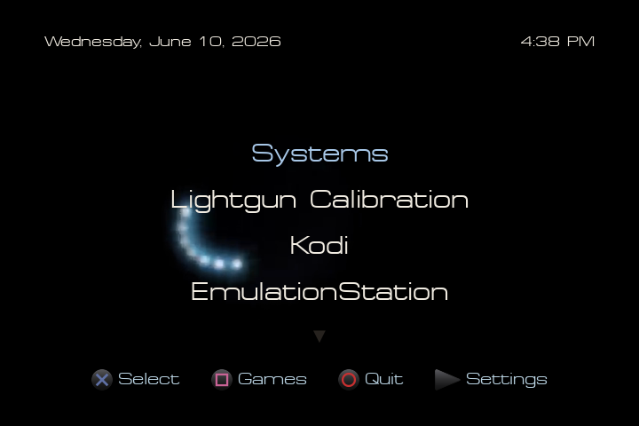
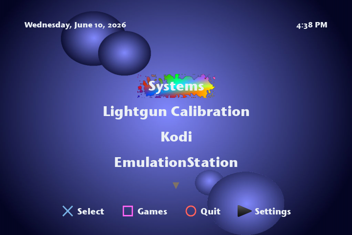
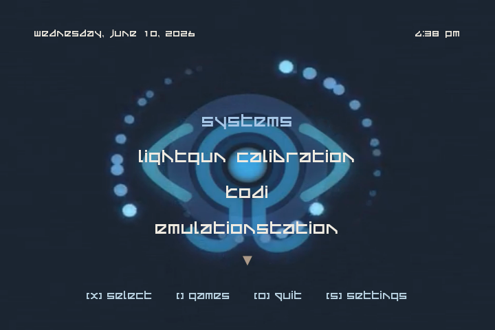
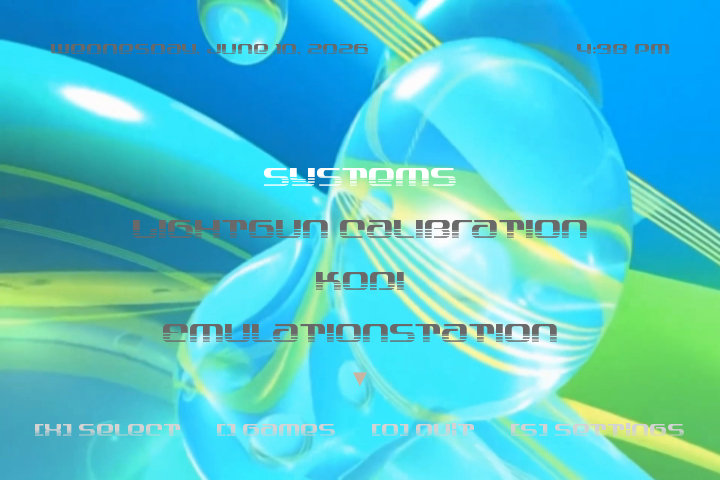

# emotionMenu
A CRT-specific frontend for multipurpose Raspberry Pi setups, mimicking various retro game console aesthetics. Written in Python with Pygame and the AV library.






## Features
- A 10-foot interface designed specifically for use with CRT TVs, which includes nostalgic themes, two of which are based around the Playstation and Playstation 2's visual design languages.
- Video & audio loop and still image background support for dynamic themes!
- Easily add and launch any Linux application from the main menu from any type of input!
- Launch your EmulationStation games directly from emotionMenu's "Games" menu, with cover art and synopsis support!
- Automatic detection and configuration of USB lightguns, with calibration options appearing in the Settings menu if necessary. 
- Automatic detection of physical PS1/PS2 disks at the main menu, with optional CD/DVD autostart!
- NFC GameCard support, launch all of your favourite titles via NFC cards for hybrid physical/digital game launching!
- Go full couch potato and view, browse and launch your games directly from your phone via emotionMenu's optional web launcher!
- Incredibly simply to create custom themes for, simply copy your font, background image/video, and background audio of choice to a new folder in the "themes" directory, create a new "theme.cfg" file with text colour values and alignments, and you're set!

## Installation
- Download the latest release .zip
- Extract the "emotionMenu" folder somewhere you'll remember on your Raspberry Pi, such as the root of your home directory (ie; /home/pi/emotionMenu/)
- From here, you can either run the Python script directly from the terminal via "python3 emotionMenu.py" while in the emotionMenu directory, or add it to the end of .bashrc so that it automatically starts on login, like so!
```
# emotionMenu Launcher
if [ -z "$DISPLAY" ] && [ "$(tty)" = "/dev/tty1" ]; then
    # Set this to the directory you've extracted emotionMenu to!
    cd /home/pi/emotionMenu/
    # Launch the menu
    python3 emotionMenu.py
fi
```
- To configure settings, press Triangle (Y) or Tab and adjust them to your preferences!

## NFC GameCards
- To use NFC GameCards, you'll need to program the NFC tag you want to use with the following information. ```psx|Final Fantasy IX``` or ```snes|Zombies Ate My Neighbours```, the first section being the system as named in EmulationStation, and the game name as registered in your scraped EmulationStation game data. Note that this assumes that your multi-disc games are either include ```(Disc X)``` in their name, or have been compressed into a single-file multi-disc format, like the .PBP format for PSX games.
- Once programmed, tap the card against your NFC card reader while emotionMenu is running and your game will automatically start!
- If you have a physical game library but don't want to use the disks, you can try slipping a programmed NTAG215 sticker in/on the corner of a game case for a semi-authentic game launching experience, but I'd recommend printing out your own custom cards just in case the tags scratch up the plastic/paper of actual game boxes.

## Web Server
- To browse and launch games directly from your phone, you can enable "Web Server" from the settings menu, which will host a web server on port 1337 where you can browse all available systems and games, and launch them directly from their synopsis view!

## Why?
I've recently set up a Raspberry Pi 5 as an all-in-one retro gaming / media setup via installing Raspberry Pi OS, EmulationStation, XFCE4, Kodi, and a bunch of other goodies, and realized I didn't have a good way to swap between them all with both a keyboard/mouse setup or a controller, so I threw this together over the weekend as a basic but pretty launcher for EmulationStation, GunCon2 calibration, Kodi, and launching XFCE, but any and all launchers can be modified to your liking!

## FAQ
- "Is this a replacement for EmulationStation?"
Not at all. This is a hobby project for my already-mostly-complete ES setup. Any advanced configuration, such as input configuration and scraping, still requires ES, this is just a "straight-to-game/app" style launcher.
- "Does this work on HDTVs?"
Maybe? Probably not. Most resolution content is hardcoded for a 480p/480i resolution, as this is specifically targetting CRT setups. If I ever unravel that thread, I'll remove this section, but I probably won't, since this is intended for CRTs and similar low resolution displays.
- "How do I add/modify shortcuts?"
Open "emotionMenu.py" in your favourite text editor, look for the default launcher items (emulationStation being #1), and add/modify contents to your heart's desire! You can add as many shortcuts as you care to scroll through.
- "How do I change the background video / text colour / font / background music or make my own theme?"
You can modify "theme.cfg" in any existing theme to modify text colours and positioning, as well as replace background videos/images and fonts with your own, or create a new theme with your desired aesthetic!
- "Why make this in Python/PyGame instead of C++ / SDL?"
Python's the language I'm most fluent in and PyGame + python-av run wonderfully in terminal sessions, simple as that. C++ and SDL would be a better choice for performance and stability, but that also involves porting binaries to different platforms and whatnot, whereas this frontend can be modified to run on just about anything that runs Python and takes *nix commands.

## TODO
- [x] Add the ability to read RetroPie games list files so this can be used as it's own frontend for launching RetroPie games
- [x] Add custom theme support (will include a PS1, PS2, and Frutiger Aero theme at release)
- [x] Add "Settings" menu and associated .cfg file
- [x] Add menu text alignment options for custom themes
- [x] NFC GameCard support for directly launching games via simple-to-make custom NFC card solutions
- [ ] Add option to remove/edit entries from ES (maybe a batch "stale entry" remover as well?)
- [ ] Add an option to rotate between box and disc art if available
- [ ] Add button mapping menu on first launch and in Settings menu
- [ ] Automatic Lightgun detection & configuration (WIP, currently requires root to start/stop lightgun modules)
- [ ] Add 240p/480i resolution toggle in Settings menu, as well as Lightgun configuration options
- [ ] Maybe integrate a basic music/video player with DVD/CD support for a laff?
- [ ] PS1/PS2/VMU memory card management via mymc++ (wihch will hopefully include a PS2-style save menu with 3D icons, but that requires pyopengl integration, need to check if this is viable from terminal)
- [ ] Automatic PS1/PS2 CD/DVD detection with manual launch and auto-launch options
- [ ] Optional webserver to launch games and view synopsis and art directly from your phone
